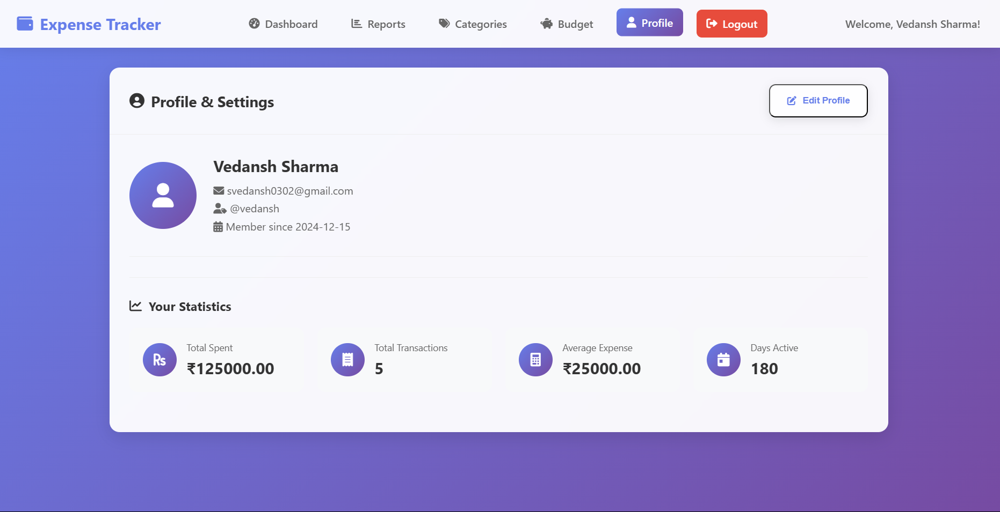
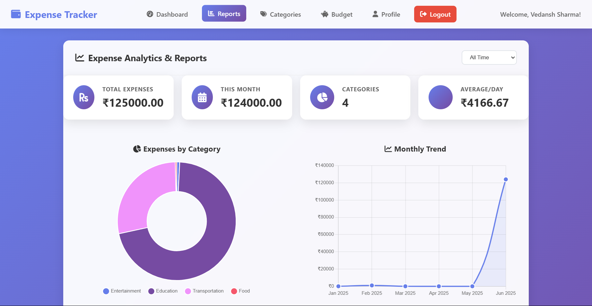
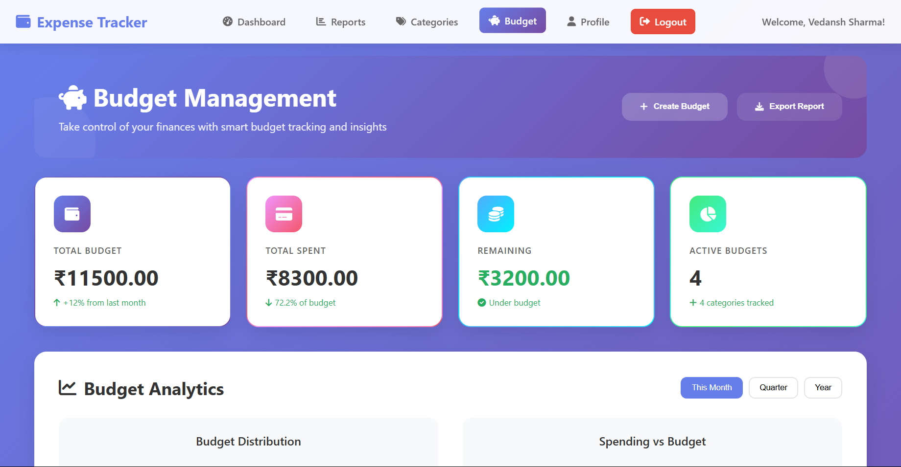

# 💰 Expense Tracker Web Application

A comprehensive, feature-rich expense tracking web application built with **Java JSP/Servlets**, **MySQL**, and modern **HTML5/CSS3/JavaScript**. Perfect for managing personal finances, tracking expenses, setting budgets, and generating detailed financial reports.

## ✨ Features

### 🏠 Dashboard
- **Real-time Statistics**: Total expenses, transaction count, averages, monthly summaries
- **Quick Actions**: Add expenses, view reports, set budgets
- **Recent Transactions**: Latest expense entries with category icons
- **Interactive Cards**: Hover effects and smooth animations

### 📊 Reports & Analytics
- **Interactive Charts**: Pie charts for category breakdown, line charts for trends
- **Category Analysis**: Detailed spending analysis with percentages
- **Time-based Filtering**: View expenses by month, quarter, year
- **Export Options**: PDF, CSV, and print functionality

### 💰 Budget Management
- **Smart Budgeting**: Set budgets by category with different periods (weekly, monthly, yearly)
- **Progress Tracking**: Visual progress bars with color-coded alerts
- **Budget Alerts**: Automatic notifications when approaching limits
- **Historical Data**: Track budget performance over time

### 👤 User Profile & Settings
- **Profile Management**: Update personal information
- **Account Security**: Change passwords, two-factor authentication
- **Data Export**: Download all personal data
- **Customizable Settings**: Notifications, themes, preferences

### 🏷️ Category Management
- **Predefined Categories**: Food, Transportation, Entertainment, Bills, etc.
- **Custom Categories**: Create personalized expense categories
- **Category Icons**: Visual representation with Font Awesome icons
- **Color Coding**: Assign custom colors to categories

### 🔐 Security Features
- **Secure Authentication**: Password hashing with BCrypt
- **Session Management**: Secure user sessions
- **SQL Injection Protection**: Prepared statements
- **Input Validation**: Client and server-side validation

## 🛠️ Technology Stack

### Backend
- **Java 11+**: Core application logic
- **JSP (JavaServer Pages)**: Dynamic web pages
- **Servlets**: HTTP request handling
- **MySQL 8.0+**: Database management
- **JDBC**: Database connectivity
- **BCrypt**: Password hashing

### Frontend
- **HTML5**: Semantic markup
- **CSS3**: Modern styling with gradients and animations
- **JavaScript ES6**: Interactive functionality
- **Font Awesome**: Icon library
- **Chart.js**: Data visualization
- **Responsive Design**: Mobile-friendly interface

### Development Environment
- **Eclipse IDE**: Java development
- **Apache Tomcat 9.0+**: Web server
- **Maven**: Dependency management (optional)
- **Git**: Version control

## 📋 Prerequisites

Before setting up the application, ensure you have:

- **Java Development Kit (JDK) 11 or higher**
- **Eclipse IDE for Enterprise Java Developers**
- **Apache Tomcat 9.0 or higher**
- **MySQL Server 8.0 or higher**
- **MySQL Workbench** (recommended for database management)
- **Web browser** (Chrome, Firefox, Safari, Edge)

## 🚀 Installation & Setup

### 1. Database Setup

1. **Install MySQL Server** and start the service
2. **Create the database** using the provided schema:
   ```bash
   mysql -u root -p < database_schema.sql
   ```
3. **Verify the installation**:
   ```sql
   USE expense_tracker;
   SHOW TABLES;
   SELECT * FROM users WHERE username = 'demo';
   ```

### 2. Project Setup in Eclipse

1. **Create Dynamic Web Project**:
   - File → New → Dynamic Web Project
   - Project name: `ExpenseTrackerApp`
   - Target runtime: Apache Tomcat v9.0
   - Dynamic web module version: 4.0

2. **Import Project Files**:
   - Copy all files from the provided structure
   - Ensure proper directory structure:
     ```
     ExpenseTrackerApp/
     ├── src/main/java/com/expense/
     ├── src/main/webapp/
     │   ├── WEB-INF/
     │   ├── css/
     │   ├── js/
     │   └── *.jsp files
     └── database_schema.sql
     ```

3. **Configure Build Path**:
   - Right-click project → Properties → Java Build Path
   - Add External JARs: `mysql-connector-j-8.0.31.jar`
   - Ensure Tomcat runtime is included

### 3. Database Configuration

Update the database connection settings in `DatabaseConnection.java`:

```java
private static final String URL = "jdbc:mysql://localhost:3306/expense_tracker";
private static final String USERNAME = "your_mysql_username";
private static final String PASSWORD = "your_mysql_password";
```

### 4. Tomcat Configuration

1. **Add Tomcat Server** in Eclipse:
   - Window → Preferences → Server → Runtime Environments
   - Add Apache Tomcat v9.0
   - Set installation directory

2. **Deploy Application**:
   - Right-click project → Run As → Run on Server
   - Select Tomcat server
   - Add project to server

### 5. MySQL Connector Setup

1. **Download MySQL Connector**:
   - Download `mysql-connector-j-8.0.31.jar`
   - Place in `src/main/webapp/WEB-INF/lib/`

2. **Verify Connection**:
   - Check Eclipse console for connection errors
   - Test with demo login credentials

## 🎯 Usage Instructions

### First Time Setup

1. **Access the application**: `http://localhost:8080/ExpenseTrackerApp`
2. **Demo Login**:
   - Username: `demo`
   - Password: `demo123`
3. **Or Register**: Create a new account with your details

### Basic Operations

#### Adding Expenses
1. Navigate to Dashboard
2. Click "Add Expense" button
3. Fill in expense details:
   - Name, amount, category, date
4. Submit the form

#### Setting Budgets
1. Go to Budget Management page
2. Click "Create Budget"
3. Select category, set limit, choose period
4. Monitor progress in real-time

#### Viewing Reports
1. Access Reports & Analytics page
2. Use filters to customize view
3. Analyze spending patterns
4. Export data as needed

#### Managing Profile
1. Click on Profile & Settings
2. Update personal information
3. Change security settings
4. Export personal data

## 📊 Database Schema

### Core Tables
- **users**: User account information
- **expenses**: All expense transactions
- **budgets**: Budget limits and periods
- **categories**: Expense categories (system & custom)

### Additional Tables
- **user_settings**: User preferences
- **income**: Income tracking
- **goals**: Financial goals
- **notifications**: System alerts

### Sample Data
The application includes comprehensive sample data:
- Demo user account
- Sample expenses across categories
- Predefined budgets
- System notifications

## 📄 License

This project is licensed under the MIT License - see the [LICENSE](LICENSE) file for details.

## 📊 Screenshots

### Dashboard


### Reports & Analytics


### Budget Management


### Profile & Settings


---

## 🎉 Acknowledgments

- **Font Awesome** for beautiful icons
- **Chart.js** for interactive charts
- **MySQL** for robust database management
- **Apache Tomcat** for reliable web server
- **Eclipse Foundation** for excellent IDE

---

**Built with ❤️ for better financial management**

*Happy expense tracking! 💰📊* 
